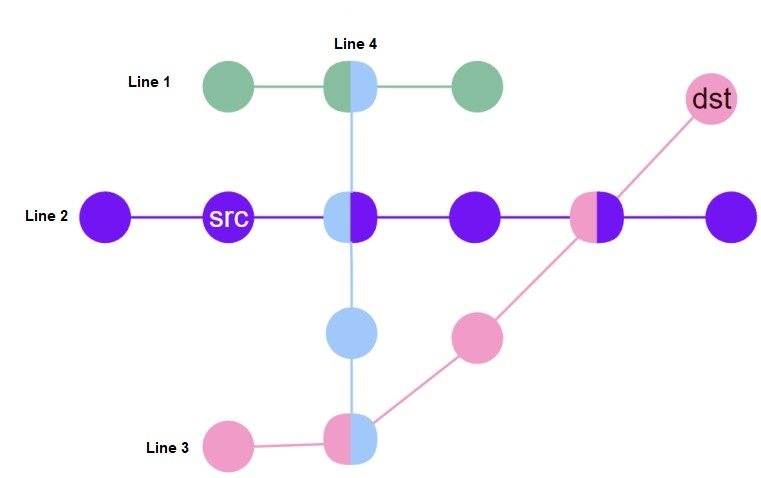

# Recursive Programming
## Directory Tree
This program is designed to display the contents of a directory in a tree-like structure within a console environment, where graphical interfaces are not available. Each line represents a folder or file, with the hierarchical relationships indicated by specific characters representing the branches of the tree. If a file or folder is nested within another folder, it will be displayed as a sub-branch of that folder.

When the directory has a significant depth, printing all its elements can become cumbersome. To avoid cluttering the display, the depth of the displayed sub-branches can be limited to a specific level.
### Input Format
The input is structured as follows:

The first line contains a natural number `n (number of items)` followed by a natural number `d (maximum display depth)`.

In the next n lines, information about each item is provided. In line i, the item name is given first, followed by a space, and then the line number of the folder where it is located. For example, if the name of the fifth item in the input is file and the folder containing this file is introduced in line 3, line 5 will be:
```
file 3
```
Items within a folder are not necessarily listed consecutively in the input, but it is guaranteed that an item's folder appears before the item in the input. The root folder is identified by number 0.
### Output Format
Each line of the output may contain the following:

1. A number of space characters.
2. Open branches (`|` character).
3. Branch heads (`__` characters).
4. The item name.

The indentation of each item indicates its relationship to the previous item.
When displaying the depth, the following is considered:

1. For each new depth level, add three characters to the indentation.
2. These three characters can be either three spaces ( ) or one open branch and two spaces (| ). Open branches indicate that the contents of a folder are not yet fully displayed and will continue on subsequent lines.
3. After printing the name of the last item in a folder and before displaying the contents of that item, the branch for that folder closes and does not continue further.

A sample test case is written as follows.
* **Input**
```
7 5
file1 0
folder1 0
file2 2
file3 2
folder2 2
file4 5
folder3 2
```
* **Output**
```
|__file1
|__folder1
●●●|__file2
●●●|__file3
●●●|__folder2
●●●|●●|__file4
●●●|__folder3
```
### How to run
To run the test cases automatically, execute the following bash script:
```console
./judge.sh
```
## Train Stations
This program is designed to find the shortest time required to travel from a starting train station to a destination station on a train network. The train network is structured such that:
* Each train line intersects with at most one other train line at a station.
* Each station can be an intersection point for at most two train lines.
* Moving from one station to the next takes <ins>1 minute</ins>.
* Changing train lines at a station takes <ins>2 minutes</ins>.

### Input Format
The input consists of several lines as follows:

1. The first line contains an integer `n`, which represents the number of train lines.

2. For the next 2n lines:
   * For each train line from 1 to n, the first line contains the number of stations on that line.
   * The second line contains 0 or the number of the intersecting train line for each station on that line. A 0 indicates that there is no intersection at that station.
3. The last line contains:
   * The number of the starting train line.
   * The station number on the starting line where the journey begins.
   * The number of the destination train line.
   * The station number on the destination line where the journey ends.
  
Note: There is no intersection at the starting or destination stations.
### Output Format
The program outputs a single integer: the minimum time required to travel from the starting station to the destination station.

A sample test case is written as follows.

* **Input**
```
4
3
0 4 0
6
0 0 4 0 3 0
5
0 4 0 2 0
4
1 2 0 3
2 2 3 5
```
* **Output**
```
6
```
### How to run
To run the test cases automatically, execute the following bash script:
```console
./judge.sh
```
